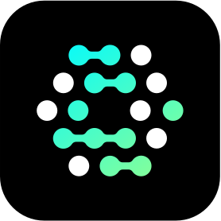

<!--  -->

# Info

- Hi! I'm from VietNam.

## My stack

### Language

  
  

### Markup

  
  
  

### Backend

  
  
  
  <!--  -->
  
  
  <!--  -->
  
  
  
  
  
  <!--  -->

<!--
### Design

  

 -->

### FrontEnd

  
  
  
  
  <!--  -->
  
  
  
  
  
  <!--  -->

## Connect with me

  
  

## Virtualization

  
  

## OS

  
  
  
  

## Editors

  
  

## Productivity Tools

  <!--  -->
  
  
  <!--  -->

## Secret management

  

## Development tools

- SSH
  - Winscp
  - RemoteSSH (VsCode)
  - Putty & Pageant
  - SSHTunnelManagerGUI
- API Testing
  - PostMan
  <!-- - Vscode ThunderClient -->
- Terminal
  - Cmder with OhMyPosh
  - Git Bash
  - Zsh

## Other Tools

- Multiple display: Display Fusion
